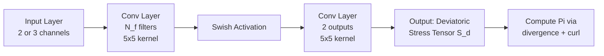

# Turbulence Closure With Small, Local Neural Networks: Forced Two-Dimensional and Beta-Plane Flows

## Authors
Kaushik Srinivasan, Mickael D. Chekroun, James C. McWilliams

## Publication
Journal of Advances in Modeling Earth Systems, 16, e2023MS003795 (2024)

## Summary

This paper demonstrates that shallow 2-layer convolutional neural networks (CNNs) with only $O(1000)$ parameters can accurately parameterize sub-grid scale (SGS) fluxes in high Reynolds number ($\text{Re} \approx 25{,}000$) two-dimensional turbulence on the beta-plane. The approach achieves stable, accurate, and long-term online solutions at $16\times$ downscaling factors, using CNNs two orders of magnitude smaller than recent studies employing 8-10 layer networks.

## Key Contributions

1. **Shallow CNN Success**: Simple 2-layer CNNs with $O(1000)$ parameters suffice for accurate turbulence closure, leading to substantially faster and more efficient online Large Eddy Simulation (LES) runs compared to deep networks.

2. **Hyperparameter Optimization**: Extensive searching in learning rate and weight decay coefficient space, combined with cyclical learning rate annealing, produces more robust and accurate online solutions than fixed learning rates.

3. **Physical Insights**: The success of shallow CNNs implies that SGS stresses have weak non-local dependence on coarse fields, consistent with the physical understanding that small scales are locally controlled by larger scales like vortices and strained filaments.

4. **Computational Efficiency**: Training each CNN model takes $\sim 1.5$ minutes on V100 GPU, while online CNN-LES runs for $6 \times 10^6$ time steps take $\sim 20$ minutes, making extensive hyperparameter searches practical.

## Methodology

### Problem Setup

The study uses sinusoidally forced 2D turbulence on the beta-plane as a test case. The governing equations are the Navier-Stokes equations in vorticity-streamfunction form:

- Domain: Square domain of size $L = 2\pi$ with periodic boundary conditions
- Reynolds number: $\text{Re} = 25{,}000$
- High-resolution DNS: $1024 \times 1024$ grid
- Downscaling factor: $16\times$ (to $64 \times 64$ coarse grid)
- Two cases: $\beta = 0$ (homogeneous isotropic turbulence) and $\beta = 20$ (jet formation)

### Downscaling Approach

The downscaling uses a Gaussian filter followed by spectral cutoff:

- Gaussian filter applied before cutoff to increase correlation between SGS fluxes and coarse-grained fields
- Cutoff wavenumber: $k_c = 32$ for $64 \times 64$ grid
- This approach brings spectral learning closer to finite-difference methods common in Earth system models

### CNN Architecture

Key architectural features:
- Only 2 layers (1 hidden layer)
- Kernel size: $5\times 5$
- Number of filters $N_f$: 8, 16, or 32 (corresponding to 800, 1600, or 3200 parameters)
- Receptive field: $9\times 9$ points (effective filter width of 9)
- Single swish activation function after first layer

### Input/Output Choices

Two input configurations tested:
1. Coarse velocities: $(\bar{u}, \bar{v})$
2. Galilean invariant: $(\bar{\omega}, \bar{\sigma}_n, \bar{\sigma}_s)$ where $\omega$ is vorticity and $\sigma$ are strain components

Output: Two components of deviatoric stress tensor $S_d$
- SGS vorticity flux divergence $\Pi$ computed from $S_d$ via: $\Pi = \nabla \times (\nabla \cdot S_d)$

### Training Strategy

**Loss Function**:
$$\mathcal{L} = \|\nabla \times (\nabla \cdot S_d(\theta)) - \Pi_{\text{FDNS}}\|^2 + w_d \sum_j \theta_j^2$$

where:
- First term: Mean square error between CNN-predicted and true SGS vorticity flux divergence
- Second term: $L_2$ weight decay regularization

**Optimization**:
- Cyclical learning rate annealing (cosine annealing with warm restarts)
- Learning rate cycles over 5 epochs, dropping from maximum to zero via cosine function
- Batch size: 1 (but effective batch size $\sim 50$ due to $9\times 9$ receptive field on $64\times 64$ grid)

**Data**:
- Training: 400 snapshots from 2 trajectories (1000 time steps apart to ensure decorrelation)
- Test: 400 snapshots from 3rd trajectory
- Validation: 4th trajectory run for $T = 6 \times 10^6$ time steps for long-term online validation

**Hyperparameter Search**:
- Learning rate: $\{10^{-4}, 10^{-3}, 10^{-2}\}$
- Weight decay: $\{10^{-5}, 10^{-4}, 10^{-3}\}$ for $\beta=0$, $\{10^{-3}, 10^{-2}, 10^{-1}\}$ for $\beta=20$
- Hidden layer sizes: $N_f \in \{8, 16, 32\}$
- Total: 108 models trained for each $\beta$ value

## Results

### Offline Accuracy

- Test set $R^2$ ranges from 0.73 to 0.8 across different models
- Prediction errors show similar small-scale structure across different models and learning strategies
- High-wavenumber disagreements persist even with deeper networks, attributed to spectral cutoff leakage

### Online Performance

**Forecast Accuracy**:
- CNN-LES solutions decorrelate from ground truth $\sim 2\times$ slower than Smagorinsky parameterization
- Cyclical learning rate models show better forecast accuracy for $\beta=20$ case
- Decorrelation time defined as when correlation drops below 0.96

**Long-Term Accuracy** ($T = 6 \times 10^6$ time steps):

For $\beta=0$:
- All four CNN configurations (cyclical/fixed lr, velocity/vorticity inputs) show good agreement
- Accurate reproduction of energy spectrum $E(k)$, SGS spectrum, cross-scale fluxes, and PDFs
- Slight advantage for cyclical learning rate cases

For $\beta=20$:
- Cyclical annealing with $(\bar{u}, \bar{v})$ inputs substantially outperforms other configurations
- Accurate jet structure and statistics
- Surprisingly, Galilean invariant inputs perform worse for jet case

**Comparison with Baselines**:
- CNN-LES significantly outperforms Smagorinsky and Leith parameterizations
- Smagorinsky captures inverse cascade poorly and misses vorticity distribution tails
- Best Smagorinsky constant ($c_s=0.025$) shows energy pile-up at small scales

### Key Findings from Hyperparameter Analysis

1. **Cyclical vs Fixed Learning Rate**:
   - Cyclical annealing produces tighter clustering and lower errors in online metrics
   - More robust across hyperparameter variations
   - Median online error substantially lower with narrower quantile ranges
   - Fewer numerical instabilities (84/108 stable for $\beta=0$ vs some unstable for fixed lr)

2. **Input Choice**:
   - For $\beta=0$: Both $(\bar{u}, \bar{v})$ and $(\bar{\omega}, \bar{\sigma})$ work comparably well
   - For $\beta=20$: $(\bar{u}, \bar{v})$ inputs substantially better for jet flows
   - Implication: Galilean invariance constraint may not be critical; NNs can learn this symmetry with sufficient data

3. **Network Depth**:
   - Increasing number of filters ($N_f$) decreases offline error systematically
   - Online error improvement much smaller with increased $N_f$
   - Weak correlation between offline and online performance

4. **Random Seed Sensitivity**:
   - Cyclical lr cases more robust to seed variations
   - Fixed lr cases show 4/18 unstable runs vs 0/18 for cyclical lr
   - Cyclical lr maintains advantages of fidelity and robustness across seed variations

## Physical Implications

### Locality of SGS Interactions

The success of shallow 2-layer CNNs (with $9\times 9$ receptive field) implies:

1. **Weak Non-Locality**: SGS stresses depend only weakly on spatially distant coarse fields
2. **Physical Consistency**: Aligns with understanding that small scales are locally controlled by larger coherent structures (vortices, filaments)
3. **Computational Benefits**: Shallow CNNs easier to incorporate into domain-decomposed climate models

Cross-correlation analysis between resolved vorticity and SGS flux shows:
- For $\beta=0$: Correlation weak beyond 7 grid points
- For $\beta=20$: Along-jet correlation similar to $\beta=0$; cross-jet correlation longer but still relatively local

### Comparison with Theory

Results support ideas from Foias et al. (1988, 1991) about parameterizing small scales in terms of large scales via finite-dimensional manifolds. The data-driven CNN approach:
- Achieves closure for cutoffs within inertial range
- Suggests existence of nonlinear function $\Pi_{\text{CNN}}$ such that: $\Pi = \Pi_{\text{CNN}}(u, v) + \epsilon$
- Residual $\epsilon$ controlled and small in mean square sense
- Opens path toward interpretable analytical formulas

## Limitations and Future Work

1. **Generalization**: Only tested on idealized 2D turbulence; real ocean/atmosphere flows more complex
2. **Robustness**: Transfer learning between $\beta=0$ and $\beta=20$ not explored
3. **Memory Effects**: Memory and stochastic terms may emerge at lower cutoff scales
4. **Interpretability**: Shallow CNNs more amenable to interpretation, but explicit interpretation not performed

Future directions:
- Test on more realistic flow configurations
- Develop analytical formulas exploiting shallow CNN structure
- Incorporate memory and stochastic terms for lower cutoff scales
- Extend to 3D flows and stratified turbulence

## Computational Details

- High-resolution solver: Pseudospectral method with CN-AB2 time-stepping
- Time step: $5 \times 10^{-5}$
- Grid: $1024 \times 1024$ for DNS
- Coarse grid: $64 \times 64$ ($16\times$ downscaling)
- Training framework: PyTorch with He initialization
- No data normalization or batch normalization layers used

## Physics Glossary

**Reynolds Number ($\text{Re}$)**: Dimensionless number measuring the ratio of inertial forces to viscous forces in a fluid flow. $\text{Re} = UL/\nu$ where $U$ is characteristic velocity, $L$ is characteristic length, and $\nu$ is kinematic viscosity. High $\text{Re}$ ($\sim 25{,}000$ in this study) indicates turbulent flow where inertial forces dominate. Example: Water flowing through a pipe at high speed has high $\text{Re}$ and exhibits turbulent, chaotic motion.

**Beta-Plane**: A simplified model of planetary rotation where the Coriolis parameter $f$ varies linearly with latitude $y$: $f = f_0 + \beta y$. This approximation captures differential rotation effects in a tangent plane. Used extensively in geophysical fluid dynamics to study atmospheric and oceanic flows. Example: On Earth, $\beta = \partial f/\partial y$ captures how rotation rate changes from equator to poles.

**Vorticity ($\omega$)**: A measure of local rotation in a fluid, defined as $\omega = \nabla \times \mathbf{v} = \partial v/\partial x - \partial u/\partial y$ in 2D. Represents twice the local angular velocity of a fluid element. Coherent vortices are regions of concentrated vorticity. Example: A tornado has intense positive or negative vorticity depending on rotation direction.

**Streamfunction ($\psi$)**: A scalar field whose contours represent streamlines of the flow. In 2D incompressible flow: $u = -\partial\psi/\partial y$, $v = \partial\psi/\partial x$. Automatically satisfies continuity equation (incompressibility). The Laplacian of streamfunction gives vorticity: $\omega = \nabla^2 \psi$. Example: Concentric circles of constant $\psi$ around a point represent circular flow.

**Enstrophy ($Z$)**: The squared vorticity integrated over the domain: $Z = \int \omega^2 \, dV$. A measure of the intensity of rotation in the flow. In 2D turbulence, enstrophy cascades forward to small scales while energy cascades inversely to large scales. Example: Decaying turbulence loses enstrophy faster than energy as small vortices dissipate.

**Sub-Grid Scale (SGS) Fluxes**: The effects of small-scale motions below the resolution of a numerical model on the resolved large scales. When equations are filtered, SGS fluxes appear as additional terms representing unresolved turbulent transport. Must be parameterized for closure. Example: In weather models at 10km resolution, convective clouds at 1km scale create SGS fluxes.

**Deviatoric Stress Tensor ($S_d$)**: The traceless part of the SGS momentum flux tensor $S$, obtained by subtracting the isotropic diagonal component. Contains two independent components in 2D. Captures directional momentum transport by unresolved scales. Example: Shear stresses causing stretching and rotation of fluid parcels.

**Large Eddy Simulation (LES)**: A numerical approach where large energy-containing scales are resolved while small-scale effects are modeled. Requires parameterization of SGS fluxes. Intermediate between Direct Numerical Simulation (fully resolved) and Reynolds-Averaged models (all scales modeled). Example: LES of atmospheric boundary layer resolves large turbulent eddies but parameterizes molecular-scale mixing.

**Smagorinsky Parameterization**: A classical SGS model assuming eddy diffusivity proportional to grid size squared times strain magnitude: $\nu_e = c_s \Delta^2 |S|$. Coefficient $c_s$ typically $O(0.1)$. Purely dissipative. Widely used in LES despite limitations. Example: In ocean models, Smagorinsky provides horizontal eddy viscosity.

**Leith Parameterization**: An SGS model for 2D turbulence with eddy diffusivity proportional to grid size cubed times vorticity gradient: $\nu_e = c_l \Delta^3 |\nabla \omega|$. Designed for enstrophy cascade in 2D flows. Example: Used in quasi-geostrophic ocean eddy parameterizations.

**Inverse Energy Cascade**: In 2D turbulence, energy transfers from small scales to large scales (opposite of 3D). Results from vortex merging and interaction. Leads to formation of large coherent structures. Fundamental property distinguishing 2D from 3D turbulence. Example: Jupiter's Great Red Spot formed and maintained by inverse cascade.

**Forward Enstrophy Cascade**: In 2D turbulence, enstrophy transfers from large scales to small scales where it dissipates. Occurs simultaneously with inverse energy cascade at scales larger than forcing. Creates fine filamentary structures. Example: Tracer filaments stretched into thin spirals around vortices.

**Rossby Waves**: Large-scale planetary waves arising from beta-effect (variation of Coriolis parameter). Propagate westward with phase speed. Important for weather patterns and ocean circulation. Characterized by potential vorticity conservation. Example: Atmospheric jet stream meanders are Rossby waves.

**Zonostrophic Instability**: A turbulent instability mechanism leading to formation of zonal jets (alternating east-west flows) on beta-plane. Results from interaction of eddies with mean flow. Creates banded jet structures seen on Jupiter. Example: Multiple jet streams in Jovian atmosphere.

**Direct Numerical Simulation (DNS)**: Numerical solution of Navier-Stokes equations with all relevant scales fully resolved, from largest energy-containing eddies to smallest dissipative scales (Kolmogorov scale). No turbulence model needed. Computationally expensive, limited to moderate $\text{Re}$. Example: DNS of homogeneous isotropic turbulence in periodic box.

**Downscaling/Coarse-Graining**: Process of reducing spatial resolution by filtering high-resolution data. Creates need for SGS parameterization. Can use sharp spectral cutoff or smooth filters (Gaussian, exponential). Example: Going from 1km to 16km grid in atmospheric model requires $16\times$ downscaling.

**Receptive Field (RF)**: The spatial region in the input that influences a given output point of a neural network. For CNNs, RF grows linearly with number of layers: $\text{RF} = (n-1)(k-1) + k$ for $n$ layers with kernel size $k$. Determines effective spatial non-locality. Example: 2-layer CNN with $5\times 5$ kernels has $9\times 9$ RF.

**Galilean Invariance**: Physical principle that equations of motion remain unchanged under constant velocity transformations. Vorticity and velocity gradients are Galilean invariant, but velocities and streamfunction are not. Important symmetry for turbulence models. Example: Adding uniform flow $U$ to the domain should not change vorticity field.

**Jacobian $J(\psi, \omega)$**: The advection term in 2D vorticity equation: $J(\psi, \omega) = \frac{\partial\psi}{\partial x}\frac{\partial\omega}{\partial y} - \frac{\partial\omega}{\partial x}\frac{\partial\psi}{\partial y}$. Represents nonlinear advection of vorticity by the velocity field. Example: Vortices advect each other through Jacobian interaction.

**Coriolis Parameter ($f$)**: Twice the local vertical component of planetary rotation: $f = 2\Omega\sin(\text{latitude})$. Causes moving objects to deflect (right in NH, left in SH). Varies with latitude on spherical planet. Example: $f \sim 10^{-4}$ s$^{-1}$ at mid-latitudes on Earth.

**Strain Rate Tensor**: Symmetric part of velocity gradient tensor capturing deformation. In 2D, characterized by normal strain $\sigma_n = \partial u/\partial x - \partial v/\partial y$ and shear strain $\sigma_s = \partial v/\partial x + \partial u/\partial y$. Magnitude $|S| = \sqrt{\sigma_n^2 + \sigma_s^2}$. Example: Regions of high strain stretch vortices into filaments.

**Energy Spectrum $E(k)$**: Distribution of kinetic energy across wavenumbers $k$. In turbulence, shows power-law scaling in inertial range: $E(k) \sim k^{-\alpha}$. For 2D turbulence in inverse cascade: $\alpha = 5/3$ (Kraichnan-Batchelor spectrum). Example: Slope change in $E(k)$ indicates transition from one cascade to another.

**Cross-Scale Flux**: Transfer rate of energy or enstrophy between different scales. Energy flux $E_{\text{flux}}(k) = \text{Re}(-\Pi(k)\hat{\psi}^*)$ shows direction of cascade. Negative = inverse (to large scales), positive = forward (to small scales). Example: Negative $E_{\text{flux}}$ at $k > k_f$ confirms inverse energy cascade.

**Dual Cascade**: Unique property of 2D turbulence where energy cascades inversely to large scales while enstrophy cascades forward to small scales simultaneously. Forced turbulence exhibits both cascades from forcing scale. Example: Energy accumulates at domain scale while enstrophy dissipates at grid scale.

**Intermittency**: Non-Gaussian statistics with heavy tails in probability distributions. Caused by rare intense events (strong vortices). Makes long-time averaging necessary for convergence. Characteristic of high $\text{Re}$ turbulence. Example: Extreme vorticity values occur far more frequently than Gaussian prediction.

**Coherent Structures**: Organized flow patterns that persist for long times relative to eddy turnover time. In 2D turbulence: vortices and strained filaments. Result from nonlinear vortex dynamics. Dominate flow statistics and transport. Example: Oceanic mesoscale eddies live for months while rotating many times.

**Eddy Diffusivity ($\nu_e$)**: Effective turbulent viscosity representing subgrid momentum mixing. Generally much larger than molecular viscosity. Spatially and temporally varying. Closure problem: relate $\nu_e$ to resolved fields. Example: Ocean eddy diffusivity $\sim 1000$ m$^2$/s vs molecular $\sim 10^{-6}$ m$^2$/s.

**Cyclical Learning Rate Annealing**: Training strategy where learning rate periodically decreases (via cosine schedule) then suddenly resets to maximum value. Helps escape local minima and provides implicit regularization. Improves generalization. Example: lr drops from 0.001 to 0 over 5 epochs, then jumps back to 0.001.

**Weight Decay**: Regularization technique adding penalty term proportional to sum of squared weights: $L_2$ penalty = $w_d\sum_j \theta_j^2$. Prevents overfitting by encouraging smaller weights. Equivalent to $L_2$ regularization. Example: $w_d = 10^{-4}$ adds small penalty discouraging large network weights.

**Convolutional Neural Network (CNN)**: Neural network with layers performing convolution operations. Exploits translational symmetry. Each convolutional filter scans entire input with shared weights. Efficient for spatial data. Example: $5\times 5$ convolutional kernel slides across $64\times 64$ image extracting features.

**Kernel Density Estimation (KDE)**: Non-parametric method for estimating probability density function from samples. Smooths histogram using kernel function. Bandwidth selection crucial. Useful for turbulence PDFs with non-Gaussian heavy tails. Example: Gaussian kernel KDE produces smooth PDF estimate from discrete vorticity samples.

## Knowledge Verification Quiz

**Q1: What is the main advantage of using shallow 2-layer CNNs over deep 8-10 layer networks in this study?**
Reference: Abstract, Section 1.2, Section 3.1
Answer: Shallow CNNs with only $O(1000)$ parameters are two orders of magnitude smaller, train much faster ($\sim 1.5$ min vs longer times), run more efficiently online ($\sim 20$ min for long simulations), and importantly imply that SGS stresses have weak non-local dependence on coarse fields. The shallow architecture is also more interpretable and easier to deploy in domain-decomposed climate models.

**Q2: What Reynolds number is used in this study and why is it significant?**
Reference: Section 2.1
Answer: $\text{Re} = 25{,}000$. This is significant because it represents high Reynolds number turbulent flow where the viscosity coefficient ($1/\text{Re}$) is chosen such that decreasing grid size or increasing $\text{Re}$ further would lead to energy pile-up at smallest wavenumbers and numerical instability. This makes closure challenging as small errors at SGS level amplify due to inverse cascade.

**Q3: What two input configurations are tested, and which performs better for the beta-plane jet case?**
Reference: Sections 2.5, 4.2.2
Answer: Two configurations: (1) coarse velocities $(\bar{u}, \bar{v})$, and (2) Galilean invariant inputs $(\bar{\omega}, \bar{\sigma}_n, \bar{\sigma}_s)$. Surprisingly, the non-Galilean invariant velocity inputs $(\bar{u}, \bar{v})$ substantially outperform for $\beta=20$ jets, while both work comparably for $\beta=0$. This suggests NNs can learn Galilean invariance from data.

**Q4: What is the receptive field of the 2-layer CNN and why is this important?**
Reference: Sections 2.4, 3.1, 5.1
Answer: The receptive field is $9\times 9$ grid points (effective filter width of 9). This is important because it demonstrates that SGS closure requires only weak spatial non-locality. Cross-correlation analysis shows correlation weak beyond 7 grid points. This has implications for deployment in domain-decomposed climate models where inter-process communication is expensive.

**Q5: Describe the downscaling approach and filtering strategy used.**
Reference: Section 2.2
Answer: $16\times$ downscaling from $1024\times 1024$ DNS grid to $64\times 64$ coarse grid. Uses Gaussian filter followed by spectral cutoff at $k_c=32$. The Gaussian filter increases correlation between SGS fluxes and coarse fields, makes learning easier due to spectral bias of NNs, and brings approach closer to finite-difference methods. The filter width is $\Delta_F = 2\Delta_c$.

**Q6: What is cyclical learning rate annealing and why does it outperform fixed learning rates?**
Reference: Sections 3.3, 4.2.3, Appendix A
Answer: Cyclical annealing uses cosine schedule where learning rate drops from maximum to zero over 5 epochs, then suddenly resets to maximum. It outperforms fixed lr by: (1) producing tighter clustering and lower errors in online metrics, (2) being more robust across hyperparameter variations, (3) having substantially fewer numerical instabilities (84/108 stable for $\beta=0$ vs fewer for fixed lr), and (4) providing implicit regularization to escape local minima.

**Q7: What is the loss function used and what does it minimize?**
Reference: Section 3.2
Answer: $\mathcal{L} = \|\nabla \times (\nabla \cdot S_d(\theta)) - \Pi_{\text{FDNS}}\|^2 + w_d\sum_j \theta_j^2$. It minimizes the $L_2$ norm between CNN-predicted SGS vorticity flux divergence and the true FDNS value, plus $L_2$ weight decay regularization. Notably, it does not use physics-informed constraints like energy or enstrophy conservation, unlike some recent studies.

**Q8: What is the deviatoric stress tensor and why is it used instead of the full stress tensor?**
Reference: Section 2.3
Answer: The deviatoric stress tensor $S_d$ is the traceless part of the SGS momentum flux tensor $S$, containing only two independent components: $(\tau_{uu} - \tau_{vv})/2$ and $\tau_{uv}$. The isotropic diagonal component $S_0 = (\tau_{uu} + \tau_{vv})/2$ does not contribute to the vorticity flux divergence since $\nabla \times (\nabla \cdot S_0) = 0$. Using $S_d$ reduces output dimensionality from 3 to 2 components.

**Q9: How much training data is used and how is temporal decorrelation ensured?**
Reference: Section 3.2
Answer: 400 training snapshots from 2 trajectories (200 each), 400 test snapshots from 3rd trajectory, and 4th trajectory for validation. Snapshots are taken 1000 time steps apart to ensure decorrelation following Guan et al. (2022). This corresponds to 400,000 high-resolution model iterations for training data generation.

**Q10: What is the dual cascade in 2D turbulence and how is it verified in the CNN-LES results?**
Reference: Sections 2.1, 3.5, Figures 7 and 9
Answer: Dual cascade means energy cascades inversely to large scales (negative $E_{\text{flux}}$ for $k > k_f$) while enstrophy cascades forward to small scales (positive $Z_{\text{flux}}$ for $k > k_f$) simultaneously from the forcing scale $k_f=4$. CNN-LES accurately reproduces both cascades, while Smagorinsky parameterization fails to capture the inverse energy cascade, showing energy pile-up instead.

**Q11: How does the paper define forecast accuracy vs long-term accuracy?**
Reference: Sections 4.2.1, 4.2.2
Answer: Forecast accuracy measures how long CNN-LES correlates with ground truth FDNS, defined as decorrelation time when correlation drops below 0.96. Long-term accuracy evaluates statistics (energy spectra, PDFs, cross-scale fluxes) over $T=6 \times 10^6$ time steps. The paper finds that good forecast accuracy does not guarantee good long-term accuracy, consistent with Dresdner et al. (2022) and Ross et al. (2023).

**Q12: What are the two beta values tested and what flow regimes do they represent?**
Reference: Sections 2.1, 2.2
Answer: $\beta=0$ represents homogeneous isotropic turbulence with coherent vortices and filaments. $\beta=20$ represents beta-plane turbulence with zonostrophic instability leading to formation of alternating banded zonal jets along x-direction, breaking y-direction symmetry. Jets interact with coherent vortices, creating more complex dynamics.

**Q13: How does offline accuracy correlate with online performance?**
Reference: Sections 4.2.4, Figure 13
Answer: Weak correlation. Increasing number of filters ($N_f$) systematically decreases offline error as points shift toward origin of x-axis, but online error improvement is much smaller and difficult to discern. This highlights that large decrease in offline error leads to only small gains in online CNN-LES performance. The mean square error metric over 400 snapshots does not necessarily reflect dynamical differences.

**Q14: What computational efficiency gains are achieved compared to DNS?**
Reference: Sections 1.2, 3.4
Answer: $16\times$ downscaling means time step is $16\times$ larger, so $6 \times 10^6$ DNS time steps equal $\sim 375{,}000$ LES time steps. Each CNN-LES run takes $\sim 20$ minutes. Training each model takes only $\sim 1.5$ minutes on V100 GPU. This efficiency enabled extensive hyperparameter search: 108 models trained for each $\beta$ value. Additionally, shallow CNNs with $O(1000)$ parameters are much faster than deep networks with $O(10^5{-}10^6)$ parameters.

**Q15: Why does the Gaussian filter improve learning compared to sharp cutoff alone?**
Reference: Section 2.2
Answer: Three reasons: (1) produces SGS fluxes with higher correlation to coarse-grained fields, making learning easier; (2) addresses spectral bias of neural networks that learn low frequencies more easily than high frequencies; (3) brings spectral learning closer to finite-difference/finite-volume approaches common in Earth system models, as localized finite difference stencils can be represented as effective exponential cutoff filter.

**Q16: What is the relationship between receptive field and CNN depth?**
Reference: Section 3.1
Answer: RF grows linearly with depth: $\text{RF} = 4n + 1$ for n-layer CNN with $5\times 5$ kernels. Examples: 2-layer has $9\times 9$ RF, 11-layer (Guan et al.) has $45\times 45$ RF, 10-layer (Frezat et al.) has $41\times 41$ RF which is nearly global on $64\times 64$ domain. Ross et al. found non-zero gradients only in $9\times 9$ region for their 8-layer CNN ($21\times 21$ RF), consistent with this study's 2-layer choice.

**Q17: How does beta=20 case weight decay differ from beta=0 and why?**
Reference: Section 3.4
Answer: $\beta=20$ requires substantially higher weight decay: $\{10^{-3}, 10^{-2}, 10^{-1}\}$ vs $\{10^{-5}, 10^{-4}, 10^{-3}\}$ for $\beta=0$. This means stronger regularization is needed for jet flows. The precise reason is under investigation but likely relates to the presence of strong eddy-driven zonal jets and their interaction with eddies, creating more complex dynamics requiring stronger regularization to prevent overfitting.

**Q18: What are the three components of the SGS momentum flux tensor S and how are they decomposed?**
Reference: Section 2.3, Equation 13
Answer: $S$ has three components: $\tau_{uu}$, $\tau_{vv}$, $\tau_{uv}$ (symmetric tensor). It decomposes as $S = S_d + S_0 I$ where $S_d$ is deviatoric part with 2 independent components $[(\tau_{uu} - \tau_{vv})/2, \tau_{uv}]$ and $S_0 = (\tau_{uu} + \tau_{vv})/2$ is the diagonal isotropic part. The SGS kinetic energy $E = (\tau_{uu} + \tau_{vv})/2 = S_0$.

**Q19: How many CNN models were trained in the hyperparameter search and how many were stable?**
Reference: Section 3.4
Answer: 108 models for each $\beta$ value (3 lr values $\times$ 3 wd values $\times$ 3 $N_f$ values $\times$ 2 input types $\times$ 2 optimization types). For $\beta=0$: 84/108 were numerically stable through entire online run. For $\beta=20$: 87/108 were stable. Additionally, 2 solutions became unstable after $t=5 \times 10^6$, illustrating challenges in evaluating online stability.

**Q20: What physical insight does shallow CNN success provide about turbulence closure?**
Reference: Sections 1.2, 4.1, 5.1, 5.2
Answer: Success of shallow CNNs implies: (1) SGS stresses have simple nonlinear dependence on coarse fields (not requiring deep hierarchies), (2) weak non-local spatial dependence ($9\times 9$ RF suffices), (3) small scales locally controlled by larger coherent structures, (4) supports Foias et al. (1988, 1991) ideas about parameterizing small scales via finite-dimensional manifolds, and (5) suggests interpretability is feasible due to low dimensionality.

**Q21: What is the effective batch size and why is actual batch size 1?**
Reference: Section 3.4
Answer: Actual batch size is 1, but effective batch size is $\sim 50$ because the 2-layer CNN has $9\times 9$ receptive field, meaning it acts independently on 81-point regions. On $64\times 64$ coarse grid: $64^2 / 9^2 = 50$. Using batch size 1 avoids slow, noisy training that would normally occur. For sufficiently deep CNNs, effective and actual batch sizes would be identical.

**Q22: What are the six diagnostic quantities used to evaluate long-term accuracy?**
Reference: Section 3.5
Answer: (1) Energy spectrum $E(k)$, (2) SGS divergence spectrum $|\Pi(k)|^2$, (3) Cross-scale energy flux $E_{\text{flux}}(k)$, (4) Cross-scale enstrophy flux $Z_{\text{flux}}(k)$, (5) Vorticity PDF $P(\bar{\omega})$, (6) SGS flux PDF $P(\Pi)$. These capture both structural (spectra, PDFs) and dynamical (cross-scale fluxes) properties. Combined into total-diff metric by summing normalized differences.

**Q23: Why don't the authors use streamfunction-vorticity (psi-bar, omega-bar) as inputs?**
Reference: Sections 2.5, 4.2.2
Answer: Because streamfunction is generally not available in realistic geophysical models over complex spatial domains. Computing $\psi$ requires solving expensive Poisson equation $\nabla^2 \psi = \omega$. On spectral plane, differential operators are diagonal making $\psi$ easy to obtain, but in general numerical models this is computationally expensive, making $(\bar{\psi}, \bar{\omega})$ inputs impractical to generalize.

**Q24: How does the paper address the challenge of intermittency in turbulence statistics?**
Reference: Sections 3.5, 4.2.2
Answer: By running validation for very long time horizons $T=6 \times 10^6$ time steps and computing statistics from 3000 snapshots separated by 2000 time steps. This provides well-defined PDF estimates using simple histograms without requiring Kernel Density Estimation (KDE). Intermittency causes non-Gaussian heavy tails due to rare intense vortices, requiring extensive averaging for convergence.

**Q25: What theoretical framework does this work relate to and what new perspectives does it provide?**
Reference: Section 5.2
Answer: Relates to Foias et al. (1988, 1991) ideas about turbulent solutions evolving within thin neighborhood of finite-dimensional manifold parameterizing small scales in terms of large scales. Previous analytical attempts (Pascal & Basdevant 1992) succeeded only near dissipation range. This work shows data-driven formulas (shallow CNNs) accessible for much lower cutoffs within inertial range. Opens path toward interpretable analytical formulas exploiting discovered nearly-local structure.
