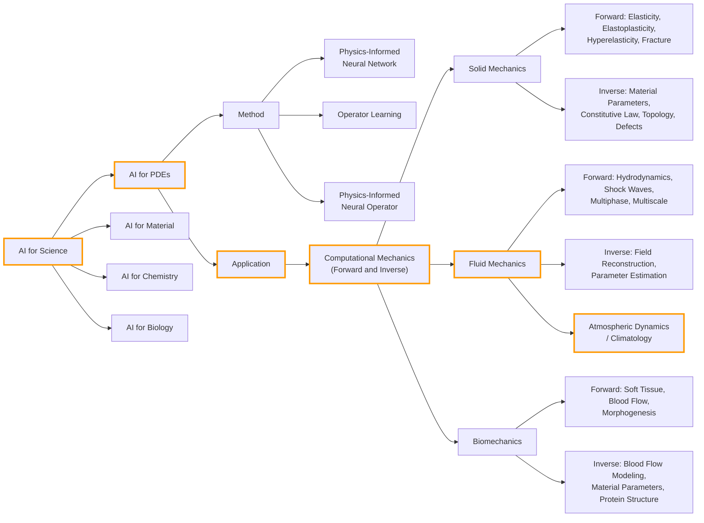
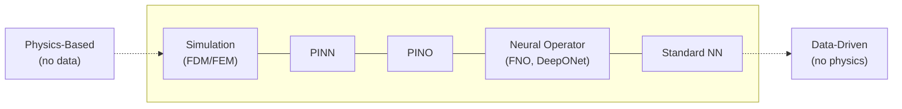

# ML / Climatology

## Example: Barotropic Vorticity Equation

Governs large-scale atmospheric flow on a rotating sphere, describing how vorticity is advected, generated by planetary rotation, and dissipated by viscosity.

$$\frac{\partial \zeta}{\partial t} + J(\psi, \zeta) + \beta \frac{\partial \psi}{\partial x} = \nu \nabla^2 \zeta$$

- $\zeta$ - relative vorticity
- $\psi$ - streamfunction
- $\beta$ - meridional gradient of the Coriolis parameter
- $\nu$ - viscosity coefficient, inversely related to Reynolds number: $Re = \frac{UL}{\nu}$

## 1. Where is AI for PDEs?

## 2. Physics-Based vs Data-Driven Approaches

## 3. Methods Overview

### Development Timeline

Two lines of work emerged independently:

- **PINNs** (Raissi et al., 2019) -- embed PDE constraints into the loss function of a neural network
- **DeepONet** (Lu et al., 2019) -- learn operators between function spaces, grounded in the universal approximation theorem for operators

In parallel, Li et al. developed the **Neural Operator** framework, parameterizing operators via learned integral kernels:

1. **Graph Kernel Network** (Li et al., 2020) -- first attempt at learning PDE solution operators, using graph-based kernels
2. **FNO** (Li et al., 2020) -- breakthrough: parameterize the kernel in Fourier space, achieving resolution invariance
3. **PINO** (Li et al., 2021) -- combine FNO with physics-informed losses, bridging operator learning and PINNs

An open direction is **physics-aware kernels**: rather than learning the kernel entirely from data, encode known physical structure (symmetries, conservation laws, Green's functions) directly into the kernel parameterization.

---

### PINN (Raissi et al., 2019)

A neural network trained to satisfy the PDE directly. The loss function penalizes residuals of the governing equation at collocation points, requiring no simulation data.

$$\mathcal{L} = \mathcal{L}_{data} + \mathcal{L}_{PDE}$$

- Input: coordinates $(x, t)$
- Output: solution $u(x, t)$
- Learns a single solution instance, must retrain for new parameters or conditions

> Raissi, M., Perdikaris, P. & Karniadakis, G.E. (2019). *J. Comput. Phys.*, 378, 686--707. [DOI](https://doi.org/10.1016/j.jcp.2018.10.045)

### DeepONet (Lu et al., 2019)

Learns a nonlinear operator mapping input functions to output functions, based on the universal approximation theorem for operators. Consists of a branch network (encodes the input function) and a trunk network (encodes the query location).

- Input: a function (e.g., initial condition) and query coordinates
- Output: the solution at the query point
- Generalizes across input functions without retraining

> Lu, L., Jin, P. & Karniadakis, G.E. (2019). [arXiv:1910.03193](https://arxiv.org/abs/1910.03193)

### FNO (Li et al., 2020)

Parameterizes the integral kernel in Fourier space. Alternates between Fourier-domain convolutions (global) and pointwise nonlinearities (local), learning resolution-invariant operator mappings.

- Input: discretized input function on a grid
- Output: discretized output function on a grid
- Resolution-invariant: can train on coarse grids, evaluate on fine grids

> Li, Z. et al. (2020). [arXiv:2010.08895](https://arxiv.org/abs/2010.08895)

### PINO (Li et al., 2021)

Combines the operator learning framework of FNO with the physics-informed loss of PINNs. Trained on both data and PDE residuals, reducing the amount of simulation data needed.

$$\mathcal{L} = \mathcal{L}_{data} + \mathcal{L}_{PDE}$$

- Inherits generalization from neural operators
- Inherits physical consistency from PINNs
- Requires less data than FNO, less retraining than PINNs

> Li, Z. et al. (2021). [arXiv:2111.03794](https://arxiv.org/abs/2111.03794)

## 4. Research Directions

<!-- Potential thesis topics and applications -->

## 5. Summary

<!-- Key takeaways -->

---

## References

1. Raissi, M., Perdikaris, P. & Karniadakis, G.E. (2019). Physics-informed neural networks. *J. Comput. Phys.*, 378, 686--707. [DOI](https://doi.org/10.1016/j.jcp.2018.10.045)
2. Lu, L., Jin, P. & Karniadakis, G.E. (2019). DeepONet: Learning nonlinear operators. [arXiv:1910.03193](https://arxiv.org/abs/1910.03193)
3. Li, Z. et al. (2020). Neural Operator: Graph Kernel Network for PDEs. [arXiv:2003.03485](https://arxiv.org/abs/2003.03485)
4. Li, Z. et al. (2020). Fourier Neural Operator for Parametric PDEs. [arXiv:2010.08895](https://arxiv.org/abs/2010.08895)
5. Li, Z. et al. (2021). Neural Operator: Learning Maps Between Function Spaces. [arXiv:2108.08481](https://arxiv.org/abs/2108.08481)
6. Li, Z. et al. (2021). Physics-Informed Neural Operator for Learning PDEs. [arXiv:2111.03794](https://arxiv.org/abs/2111.03794)
7. Sahin et al. (2024). AI for PDEs in Computational Mechanics: A Review. [arXiv:2410.19843](https://arxiv.org/abs/2410.19843)
