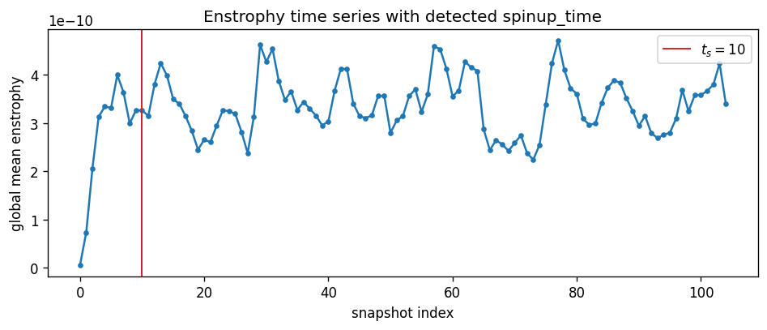
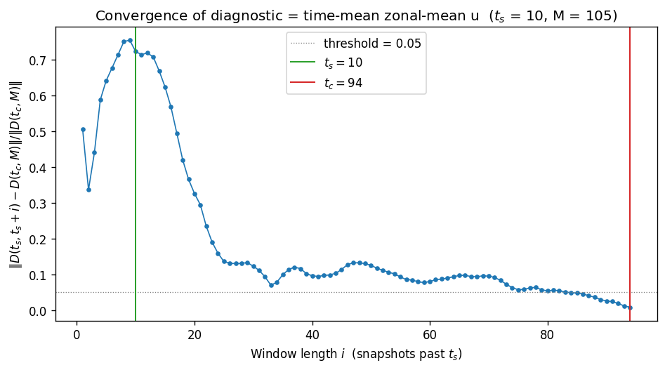
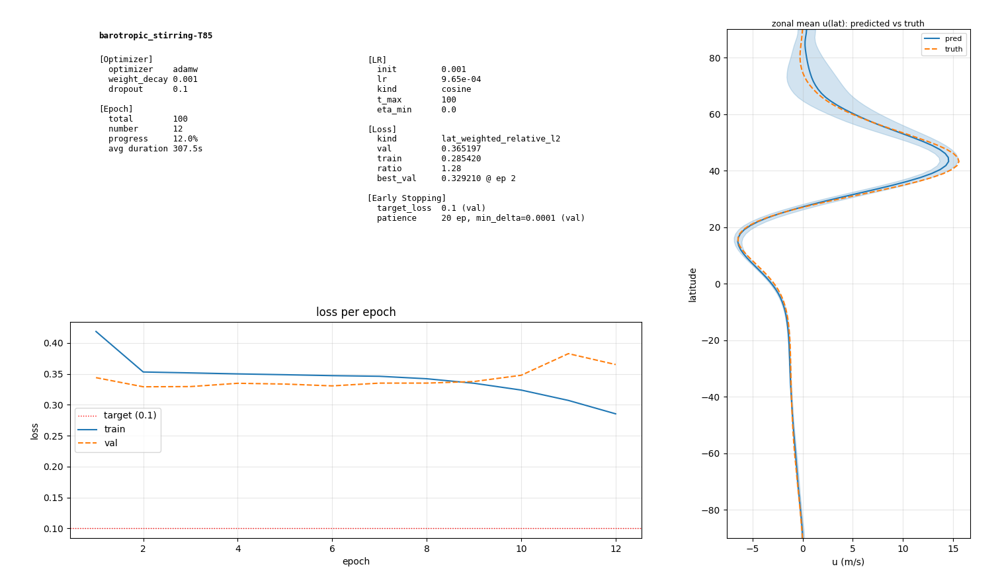

# **2026-06-09**

Climatology prediction

https://github.com/tglanz/climatology/tree/main/ml

---

# **Context**

Given a sequence of $K$ **step diagnostic** $\zeta$, instead of attempting to predict the state of the system at some later time $t$ we attempt to predict a **climatology diagnostic** $[\bar{u}]$.

By doing so, we eliminate the stochastic dimension of the forcing (Stirring in our case).

---

## **Window Selection**

- Window size $K$
- Start / End / Stride?

## **Climatology Range**

What is the time frame to compute $[\bar{u}]$ for?

---

# **Learnability**

**The underlying heuristic is that the diagnostic evolution within a window determines the climatology**

i.e. for different windows $W_{i,j}$

$$
pred(W_i) = pred(W_j) = \tilde{[\bar{u}]}
$$

 

- We don't encode time in the model

---

# **Spinup and convergence**

A simulation $S$ is composed of $M$ snapshots; Each snapshot holding dimensions (lons, lats, time, ...) and variables (vor, stirring, ucomp, ...).

- Windows are taken between the **Spinup Time** $t_s$ and the **Convergence Time** $t_c$

- Climatology $[\bar{u}]_{t_c}^{t_M}$ is computed since $t_c$ to the end of simulation

---

# Spinup

**Spinup time** is the time $t_s$ after which the simulated dynamics have stabilized post initial conditions

$t_c$ is determined by taking multiple subsequent enstorophy windows and thresholding their change of z-score

---

# Convergence (1/2)

**Convergence time** is the time $t_c \geq t_s$ after which the time mean has settled similar to the global time mean

---

# Convergence (2/2)

We determine $t_c$ based on the error:

$$\text{err}(i) = \frac{\left| [\bar{u}]_{t_s}^{t_{s+i}} - [\bar{u}]_{t_s}^{t_M} \right|_{\cos}}{\left| [\bar{u}]_{t_s}^{t_M} \right|_{\cos}}$$

Then $t_c = t_s + i^*$, where $i^*$ is the first index such that $\text{err}(i^* - h), \ldots, \text{err}(i^*) < \tau$ for hold $h$ and threshold $\tau$.

---

# **Training state**

