# Overview

The purpose of this document is to describe the current state of our work.

We will mainly focus on what *IS* - it is highly affected by what *WAS* and some lessons learned. To keep it brief, the process of reaching to this point will not be described in details. Where it matters, we will point it out. This can be expanded on separately.

<!-- This will add a "# Notations" section -->
!include ../../docs/notations.md

# Goal

## [Optional] Previously - step prediction

we worked on learning an (neural) operator $F$ that maps a sequence of $K$ vorticity snapshots $\{ \zeta_1, \zeta_2, ..., \zeta_K | \zeta_i \colon \mathbb{R}^{H \times W} \rightarrow \mathbb{R} \}$) into a predicted vorticity field $\tilde{\zeta} : \mathbb{R}^{H \times W} \rightarrow \mathbb{R}$ according to the dynamics governed by the Barotropic Vorticity with an additive **Stochastic Forcing** term, Stirring.

Illustratively; Given the vorticities:

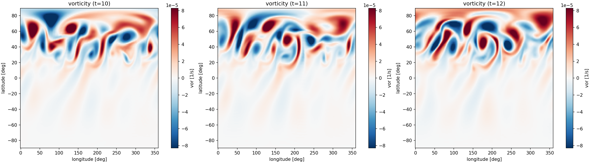

Predict:

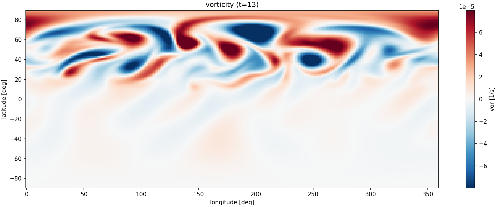

After a period of trying to train a model that learns such an operator, we came to realize that this is an ill-posed problem - Due to the stochasticity of the forcing, a sequence of $K$ vorticity snapshots can evolve randomly to different vorticity fields.

The supporting evidence for that is from ["Fourier Neural Operators Explained: A Practical Perspective"](https://arxiv.org/pdf/2512.01421), quote:
> For operator learning to be mathematically meaningful, the target mapping must be well-posed in the following sense: each admissible input function $f \in F_{in}$ must correspond to a unique output $g \in F_{out}$.
> If the
mapping is not unique, i.e. multiple valid outputs exist for the same input, a deterministic neural operator
cannot represent it consistently. In such cases, the model tends to average across possible outputs, which
often leads to blurred or unstable predictions and poor generalization.

This is exactly what we experienced while trying to train the model - it overfitted and converged to the mean.

Realizing the stochasticity of the dynamics is the problem, Orli suggested to maybe look at some statistical property of the system. Specifically, the time mean zonal mean of the zonal wind speed $[\bar{u}]$.

To my understanding - this is backed by [Ergodicity](https://en.wikipedia.org/wiki/Ergodic_theory).

## Currently - long-run climatology prediction $[\bar{u}]$

Our goal is to learn an (neural) operator $F$ that maps a sequence of $K$ vorticity snapshots (of size $H \times W$) to the long-run climatology $[\bar{u}]$.

Illustratively; Given the vorticities:

Predict:

![Example $[\bar{u}]$ climatology profile.](climatology.png){height=4cm}

Our assumption is that this statistical property of the system is unaffected by randomness throughout the evolution of the vorticity.

Furthermore, assume the long-run climatology was averaged across $M$ timesteps. Our underlying assumption, is that there is $K << M$ such that a sequence of $K$ vorticity snapshots **carry enough information** to predict the long-run climatology. Otherwise, no model can stand for the task.

# Data synthesis and training preparation

To train the model we 

- first: synthesize data using [ISCA](https://github.com/ExeClim/Isca) simulation
- second: prepare the training data based on the simulation outputs

The reasoning for the process below is due to ongoing trial and error and the attempt to train the model (I will expand on a bit after).

## Synthesis

We run ISCA simulation for BVE + Stirring.

The simulation has different parameters we can tune. At the current state, we only vary a part of the Stirring parameters.

Specifically, we do a **parameter sweep**. Meaning, we run multiple (currently 4) simulations (a.k.a replicas) for each parameter combination from the following matrix:

| Parameter | Description | Values |
|---|---|---|
| `stirring_lat0` | Latitude center of the stirring region | -10, 0, 30, 40, 50, 60, 70 deg |
| `stirring_amplitude` | Strength of the stochastic vorticity forcing | 7.5e-11, 1.0e-10, 1.25e-10 $s^{-2}$ |
| `stirring_widthy` | Meridional half-width of the Gaussian stirring envelope | 8, 12, 16 deg |

Each replica is running for 150 segments of 7 daily snapshots each. Meaning, each replica contain 1050 vorticity snapshots.

In total, we have $4 \times 7 \times 3 \times 3 = 252$ simulations.

## Data preparation

Derived from our learning goal, the training pairs are of the form $(X, Y) = ((\zeta_i, ..., \zeta_{i+K}), [\bar{u}])$.

From the simulation outputs, we create 3 datasets (common practice):
- **train**: Contain training pairs used to train the model. i.e., this are the pairs we run backpropagation according to
- **validation**: Contain training pairs used to compute our model error during training
- **test**: Contain pairs that the model did not see during training at all

The process of taking the simulation outputs and creating the training sets is known as **data splitting**. There are different ways to split the data. To validate our model properly, we should usually consider carefully how to split.

As an example, it doesn't make sense to put in the test split simulation replicas for the same Stirring configuration.

Also, different splits can verify the model generalization characteristics (e.g. inter/intra). For example, we might want to evaluate model's generalization of the Stirring's latitude. As shown above, we simulate the latitudes: -10, 0, 30, 40, 50, 60, 70.

- Interpolation: train/validate on the stirring latitudes {-10, 0, 30, 60, 70}. Hold out the latitude {40}; i.e. allocate an in distribution value to the test set

- Extrapolation: train validate on the stirring latitudes {-10, 0, 30, 40, 50, 60} but hold out the latitude {70}.

**Given the same simulation outputs**, we can/should train the model over different splits. This allows us to evaluate the model differently.

- Currently we have 3 stirring parameters that we vary. We can split in different manners, and it is affected by what we are trying to show/achieve

> NOTE: I completely skipped the topic spinup/convergence. Basically - we don't take ALL snapshots from the simulations. We skip some initial part where the simulation is "spinning up" and we also compute the region we think the dynamic has stabilized at "convergence". This is a bit technical and can be discussed seperately.

## [Optional] Reasoning / Justifications

The process of training included many trials

Initially, for simplicity, I tried to train over a single Stirring configuration at a specific latitude. Meaning, given a single Stirring configuration, I ran about 1000 simulations (150 days each). This caused the model the overfit. Including dropouts and weight regularization didn't help. My assumption was that the model just memorizes the desired profile, but doesn't learn anything.

I ran some checks, and saw that there is a relatively high variance between the computed climatology - this lead me to believe that I should run longer simulations. I created about 200 simulations, for a single stirring configuration, about 1000 days each. The variance of the climatologies went down significantly. The model behaved differently - the overfitting just became MUCH more clear. The training pairs reached an error of less that 1% but the validation set remained at about 50% error.

- My next assumption: Model memorizes harder; It gets better input to output correlation due to the lower variance.

> Note; I cannot describe the whole process without making this super long, but it also included different training configurations (e.g. optimizer, regularization), model sizes, etc...

To address this memorization, I decided to now simulate on different stirring latitudes with hope that the model will encounter more variety and thus have a stronger single to learn. The results were much worse it seemed. The training set converged to about 30% error; but the validation set did not diverge too far from it. This lead me to believe we need further variety.

Finally I made sweep to also include the stirring amplitude and width. Lowered the number of replicas per simulation (4) and increased $K = 10$ and bounded the number of snapshot sequences (Windows) per sim to 15.

# Latest results

(Attached some explanations to what we see only for the first experiment, the second ill just show the plots)

## Holding out stirring_lat0=70 (Extrapolation) 

The following training curve (Epoch / Loss) shows that

- the model **converges**. The inference on validation set is at about 15% error. This is not **Too Good** but also not **Too Bad** in my opinion. However, I think this can be improved with more data! The main takeway is that the model manages to learn and does not overfit.

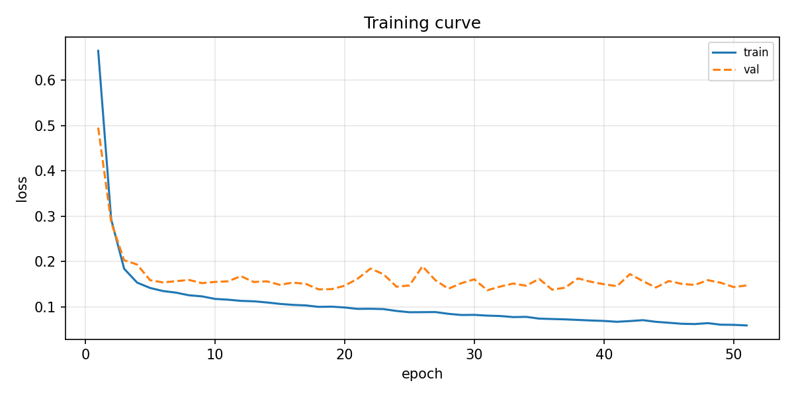

On previous iterations, the model **Seemed** like it learned, but essentially it just memorized or converged to some mean. Below is a comparison to the average error of fixed baselines:

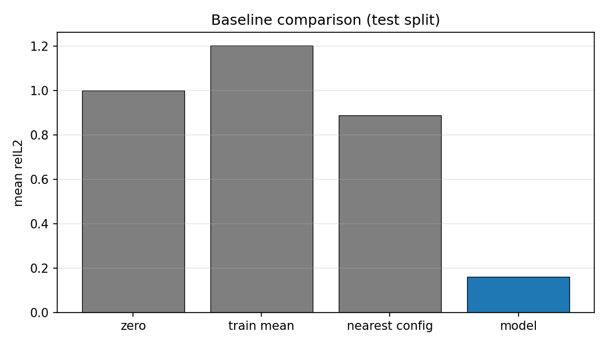

We see that our model, on average, performs better than

- zero baseline: a model that just predicts zero everywhere (relative error is 1 by definition)

- mean baseline: a model that just predicts the mean from all samples

- nearest config baseline: a model that outputs the true climatology of the nearest stirring config (in this case, )

The following plots show the error of the splits for different parameter spreads. It helps us understand whether there is a specific parameter that the model has issue to generalize. From what I understand - the answer, at least for the 3 parameters that we vary, is no!

The model generalizes pretty well - the error of the test split is worse than train/validate, and has greater variance, but I think its not THAT worse in the sense that we can improve on that using additional training data.

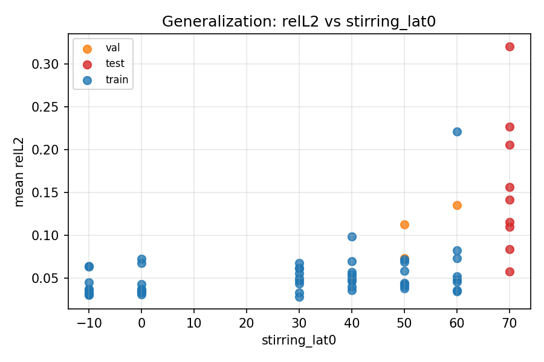

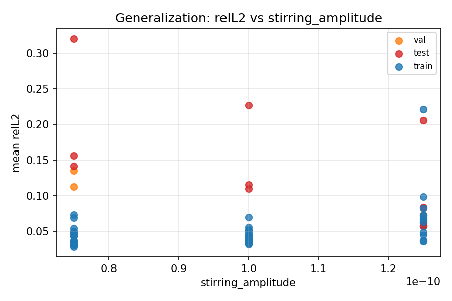

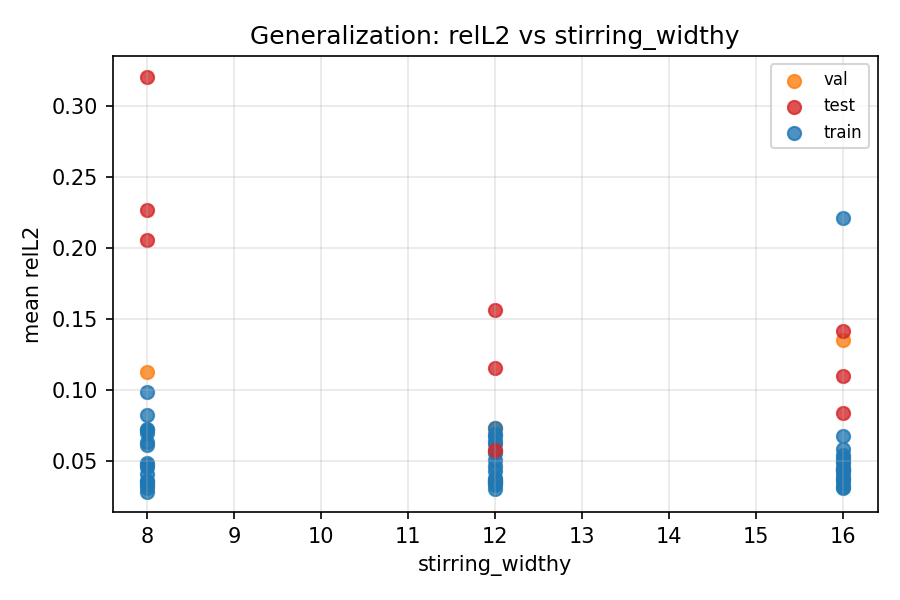

## Holding out stirring_lat0=30 (Interpolation)

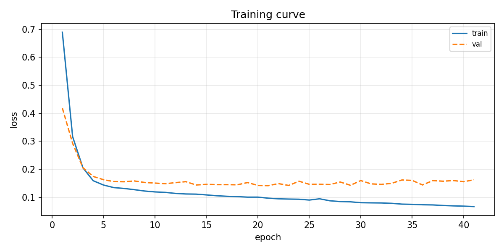

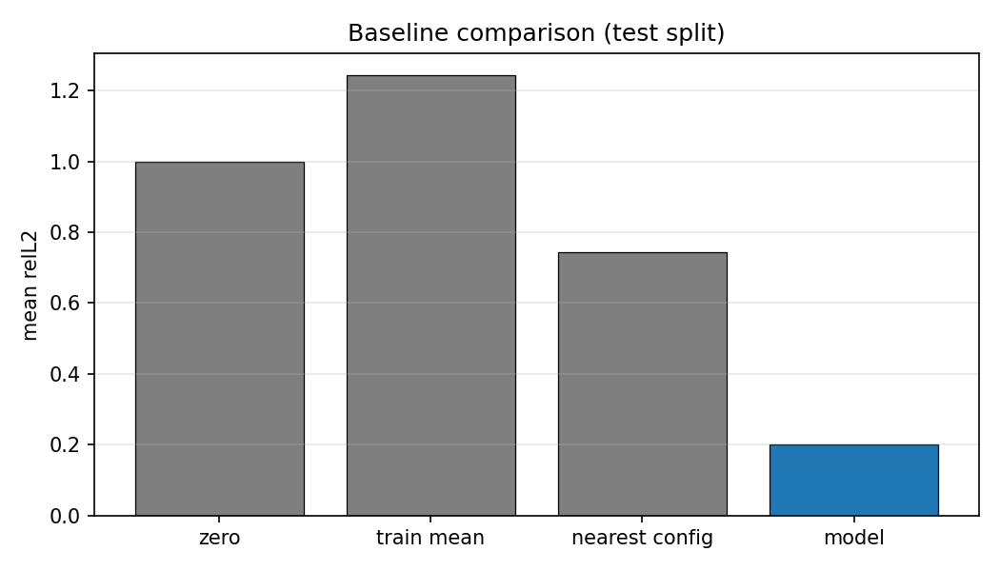

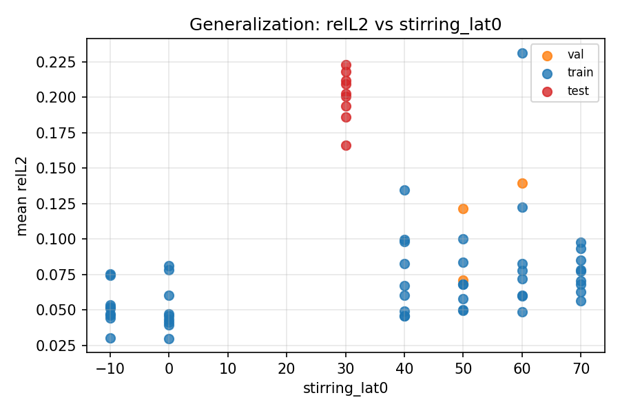

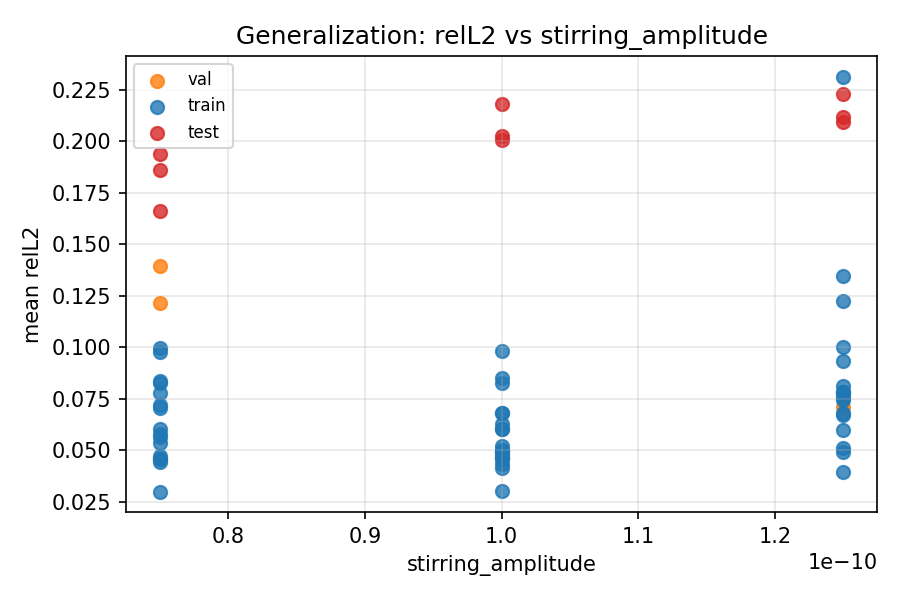

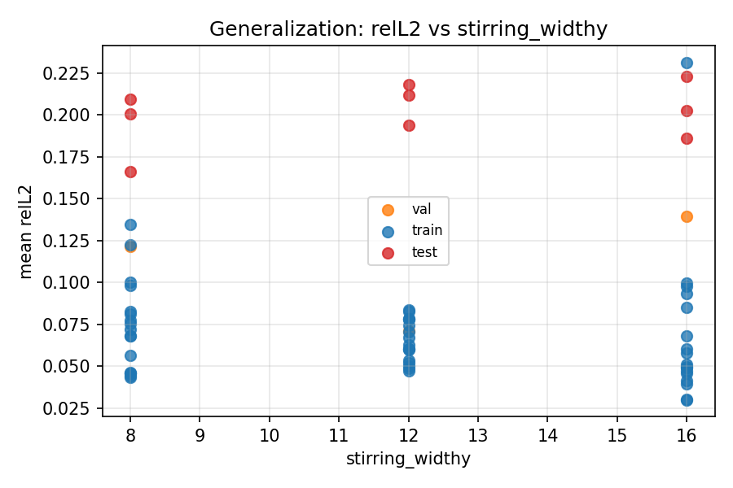

# Thesis potential directions

## No previous work

I did additional literature exploration. **I did not find any paper, or reference**, regarding the use of neural operator to map timestepped diagnostics to a statistical property.

This is for better or worse

- Why is there no such work? Is that a bad idea? not interesting? Trivial? Too complex? Not feasible?

If there is no such work, is just showcasing this is viable as a thesis?

- I mean, we could/should formulate it it better; e.g. stochastic element elimination through statistical operator learning.

> Peronal note: To me, this seems very promising as a potential thesis. But this needs to be formulated better

---

## Learning head modification

Our learned operator is a bit unique. Usually in the literature, the learned operator maps functions embedded within the same space. E.g. $(H, W) \rightarrow (H, W)$.

Our learned operator maps from a function from the grid to a latitudinal profile, i.e. $(H, W) \rightarrow (H, )$.

Presumably, we can introduce a modification to the models learning head (the final MLP layer), that leverages this.

Potentially, represent output with Spherical Harmonics??

---

## Encode physics as part of loss function

Encode some physics to the loss function (PINNs)

---

## Uncertainty quantification

We could enhance the model to also predict some error estimation alongside the predicted profile.

# Next steps

## Migrate work to HPC systems

I believe the current model can reach better performance through additional data volume and variety.

Until now, I ran everything on my laptop, which is out of storage space.

Next step:

- I will move to work within the HPC systems

## Increase simulation counts and param variety

After I migrate to the HPC systems, I will have more storage to work with.

Next step:

- Run more simulations (check additional replicas, additional param ranges)

## Learn the dynamics better

- Mainly the stirring AR process
- Understand BVE a bit more

!include ../../docs/references.md